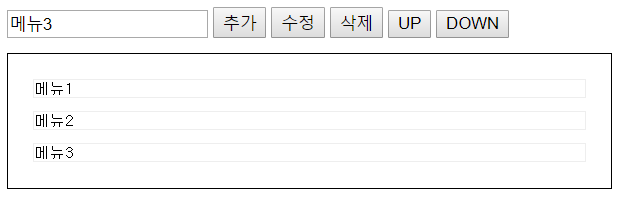
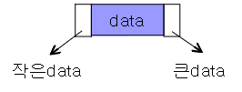
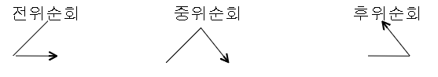
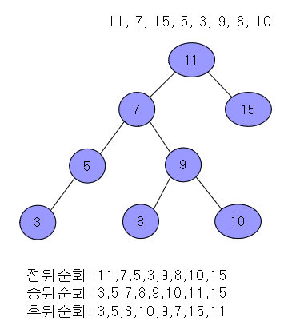
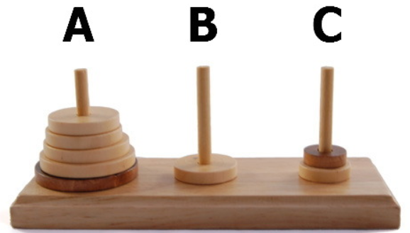
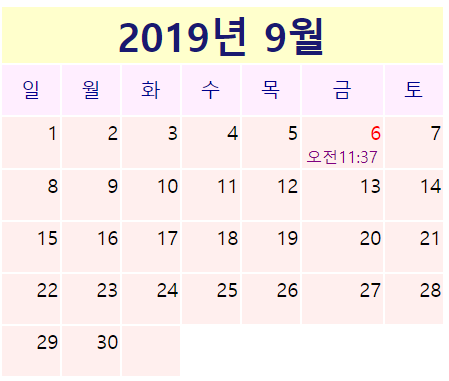
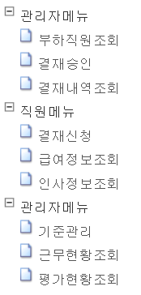

팀 과제(미니 프로젝트)
======================

## 1. 동적 추가 메뉴 만들기 (1-1.jQuery/1-2.JavaScript)
- 추가: input에 입력된 메뉴명을 선택한 Row 하단에 추가
- 수정: 선택한 Row의 메뉴명을 input에 입력한뒤 수정버튼을 클릭하면 메뉴명 수정처리
- 삭제: 선택한 메뉴명 삭제
- UP: 선택한 Row를 상단으로 이동
- DOWN: 선택한 Row를 하단으로 이동

## 2. DOM을 이용해 HTML 요소를 간단하게 만들어주는 make 함수 (JavaScript)
~~~javascript
function make(tagname, attributes, children)
/*
 tagname: tag이름
 attributes: optional, 객체, 프로퍼티와 값
 children: optional, 요소에 추가할 자식, string/element/element배열
사용예)
var body = document.getElementsByTagName('body')[0];
*/

var div = make("div", {'style':'background-color:red;', 'id':'div1'}, "hello world");
body.appendChild(div);

var tds = [make("td",{},"Name"), make("td",{},"Type"), make("td",{},"Value")];
var tr = make("tr",{}, tds);

var table = make("table", {'style':'border: 1px solid red;'}, tr);
body.appendChild(table);
~~~

## 3. 알고리즘 (JavaScript)
### 3-1. 이진탐색트리 알고리즘
- 이진탐색Tree: 2차Tree(한노드에 Data1개) + Double Linked List

- 순회: Tree에서 모든 Node를 읽는 방법

~~~javascript
var tree = new BSTree();

tree.insert(11);
tree.insert(7);
tree.insert(15);
tree.insert(5);
tree.insert(3);
tree.insert(9);
tree.insert(8);
tree.insert(10);

function printNode(value){
    console.log(value);
}
console.log('*** 중위 순회 ***');
tree.inOrderSearch(printNode);

console.log('*** 전위 순회 ***');
tree.preOrderSearch(printNode);

console.log('*** 후위 순회 ***');
tree.postOrderSearch(printNode);

console.log('********* 최대/최소값 ***********');
console.log(tree.max());  
console.log(tree.min());
~~~

### 3-2. 하노이 알고리즘
>원칙: 원반은 한번에 한 개씩 옮길 수 있고 큰 원반이 작은 원반 위로 올라가서는 안된다

~~~javascript
var source = new Stack();
source.push(3);
source.push(2);
source.push(1);

var dest = new Stack();
var helper = new Stack();

// n: 타워의 요소개수
// from:  source 타워
// to: target 타워
// helper: helper 타워
towerOfHanoi(3, source, dest, helper);
~~~

## 4. 달력그리기 (jQuery or JavaScript) (월이동, 휴일빨간색)

## 5. 동적Tree메뉴 (jQuery or JavaScript)

~~~javascript
var tree = new CreateTree(document.getElementById('div'));

// 메뉴객체 생성
// name : a 태그에 나타나는 내용
// href : a 태그에 사용될 URL
// icon : 기본 아이콘 대신할 아이콘 URL
// child : 자식배열

//root객체, root객체는 실제로 보이지 않는다
var data = {"name":“name","href":“A링크","target":“target","icon":"","child":[]};

//자식개체를 하나 생성
var childA = {"name":“관리자메뉴","href":"","target":"","icon":"","child":[]};

//자식1를 맨위개체에 붙이기
data.child.push(childA); 

//자식1의 하위개체를 생성
var childA1 = {"name":“기준등록","href":"http://w3.schools.com","target":"_blank","icon":"","child":[]};
var childA2 = {"name":“신청승인","href":" http://w3.schools.com","target":"_blank","icon":"","child":[]};

//자식1의 하위개체 붙이기
childA.child.push(childA1); 
childA.child.push(childA2); 

//트리에 메뉴객체를 연결
tree.data_init(data);
//트리메뉴를 화면에 보여준다
tree.createView();
~~~